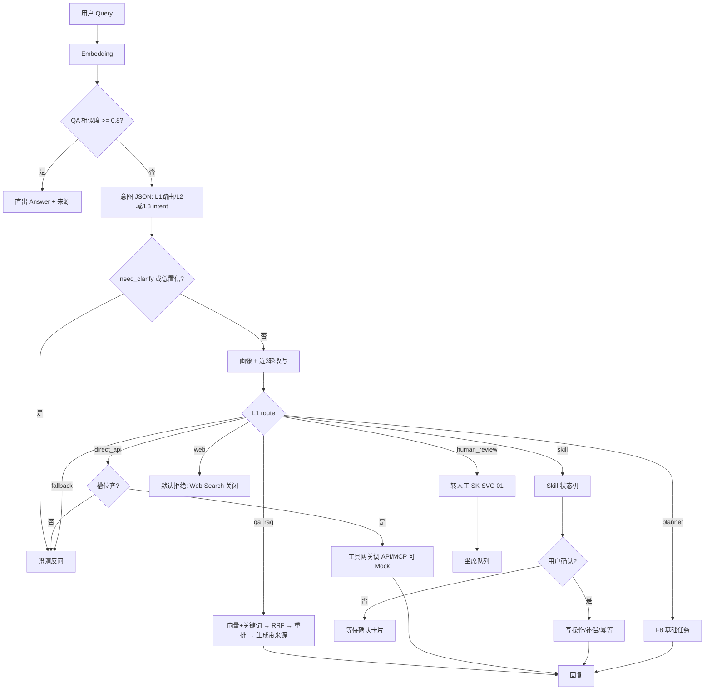

# PRD 初稿 — 太平洋金科·智能行政咨询助手

> 阶段 A 产出 | 对齐 V1.14 + 纠偏创新 | 日期：2026-08-06  
> 状态：**A1–A6 已全部确认**（2026-08-06）；待总确认后进入 B1  
> 配套：`.output/roadmap-draft.md`（A3 已确认）  
> 决策锁定：25 页 IA；8 业务域 + 2 平台域；MVP 仅 Web；Planner 分期

---

## 1. 产品概述

### 1.1 一句话

面向约 1,000 内部账号的 Web 智能行政咨询助手：可信问答、实时可查、固定 Skills 可办、材料可预审、低置信转人工，运营可治理知识/意图/Skill/工具与 Bad Case。

### 1.2 方案锚定

| 维度 | 锁定 |
|------|------|
| 能力框架 | 问 / 查 / 办 / 审 / 服 / 运 |
| 交互 | 工作台门户 + 对话三栏 + 确认卡片 + 坐席交接/AI 草稿 |
| 视觉 | Enterprise Light Ops Console（主色 `#1677FF`，底 `#F0F2F5`） |
| 前端 | Vue 3 + TypeScript + Pinia + Router（不可替换） |
| 后端 | Python 3.11+ / FastAPI / PyCore（不可替换） |
| 存储 | 目标 MySQL + Milvus；本地可降级 SQLite + FAISS |
| 登录 | MVP 账号密码 + JWT；SSO → V1.1/V2 |
| 租户 | 单租户 |

### 1.3 Mission / Persona

见 `.output/roadmap-draft.md`。UI 三端壳 × 8 类角色权限点。

---

## 2. 主要功能（A1 / A2 已确认）

| ID | 主功能 | 做 | 不做 | 完成标准 | 依赖 |
|----|--------|----|------|----------|------|
| F1 | 统一身份与权限 | 账号密码 JWT；8 角色权限；三端隔离；审计 | SSO；多租户 | 无权限不可达 | — |
| F2 | 员工工作台 | 摘要、P0 入口、迷你趋势 | 管理者大屏 BI | 默认落地可跳转 | F1 |
| F3 | 智能咨询（问） | QA→意图→记忆改写→RAG+来源 | 无来源硬编；语音 | 可追源；低置信澄清/转人工 | F11 |
| F4 | 实时查询（查） | direct_api；可 Mock 标注 | 静态文档假装实时 | ≥2 条 P0 查询可验 | F1 |
| F5 | Skills 办理（办） | 13 Skills；P0 闭环；确认卡片 | Skill 缺失转 Planner | P0 确认后任务可见 | F4/F7 |
| F6 | 合规预审（审） | 规则预检、风险提示 | 代审批、自动付款 | 与 SK-FIN-01 打通 | F7/F5 |
| F7 | 材料与 OCR | 上传、解析、校对入口、引用 | OCR 100% 承诺 | 状态可见可重试 | F1 |
| F8 | Planner（写） | MVP：建任务+进度+占位结果 | 用 Planner 办事务 | 任务可追踪 | F3 |
| F9 | 服务台（服） | 转人工、队列 SLA、交接、工单/专家、质检回访基础 | 外呼；智能排班 | 消息同步；超时高亮 | F3/F5 |
| F10 | 运营治理（运） | 知识/意图/Skill/Prompt/工具/队列；Bad Case；看板；审计 | MVP 灰度/回滚流水线 | 发布生效、下线不可召回 | F1 |
| F11 | 知识生命周期 | 草稿→待审→发布→下线；有效期/权限标签 | 爬全网；知识图谱 | 仅有效已发布可检索 | F10 |
| F12 | 评测与验收口径 | 7 类 Bad Case；10 项指标展示；回归清单 | MVP 全自动 700 份次平台 | 坏例可闭环 | F10 |
| F13 | 多端入口 | MVP：Web 桌面优先 | MVP 小程序/原生 App | 三端主流程可验收 | F1 |

**P0 闭环：** 报销、请假、IT 报修、会议室、转人工。  
**13 Skills / 36 工具：** 见 roadmap；Skill≠工具。

---

## 3. 页面清单与跳转（A4 · 已决策 25 页）

### 3.1 页面表

| 编号 | 页面 | 端 | 主功能 | 备注 |
|------|------|----|--------|------|
| P01 | 登录 | 全员 | F1 | |
| P02 | 工作台 | 员工 | F2 | 员工默认首页 |
| P03 | 智能对话 | 员工 | F3–F6、F8 | 三栏 + 确认卡片 |
| P04 | 服务大厅 | 员工 | F5 | 8 业务域 |
| P05 | 服务申请/确认 | 员工 | F5 | 与对话确认卡双入口 |
| P06 | 我的任务 | 员工 | F5/F8/F6 | **含历史 Tab**（原办理记录并入）；审批/Planner 筛选 |
| P07 | 任务详情 | 员工 | F5/F7 | |
| P08 | 我的工单 | 员工 | F9 | |
| P09 | 材料中心 | 员工 | F7 | |
| P10 | 消息中心 | 员工 | F2 | |
| P11 | 个人设置 | 员工 | F1 | |
| P12 | 队列看板 | 坐席 | F9 | 坐席默认；含图表 |
| P13 | 会话工作台 | 坐席 | F9/F3 | |
| P14 | 工单处理 | 坐席 | F9 | **专家协同为抽屉** |
| P15 | SLA 与班次 | 坐席 | F9/F12 | |
| P16 | 质检与回访 | 坐席 | F9/F12 | |
| P17 | 知识管理 | 运营 | F11/F10 | 运营默认首页 |
| P18 | 知识解析详情 | 运营 | F11/F7 | **新增** OCR/Chunk 校对 |
| P19 | 服务目录 | 运营 | F5/F10 | |
| P20 | 意图与 Prompt | 运营 | F3/F10 | 无灰度 |
| P21 | Skill 管理 | 运营 | F5/F10 | 13 Skills |
| P22 | 工具与模型 | 运营 | F4/F10 | 36 契约 + Mock |
| P23 | 队列与 SLA 配置 | 运营 | F9/F10 | |
| P24 | 运营洞察 | 运营 | F12 | **Bad Case + 指标双 Tab** |
| P25 | 权限与审计 | 运营 | F1 | 8 角色矩阵 |

### 3.2 跳转

```
P01 → P02（员工）/ P12（坐席）/ P17（运营）

员工: P02 → P03|P04|P06|P08|P09|P10|P11
      P04 → P05 → P06|P03
      P03 → P06|P08|P09
      P06 → P07 → P09

坐席: P12 → P13 → P14；P12 → P15|P16
      P13 ↔ 员工会话（WebSocket）

运营: P17 → P18
      P19–P23 发布 → 影响 P03/P04/P12
      P24（Bad Case | 指标）；P25 审计
```

**隔离：** 员工不可进坐席/运营；坐席不可进运营；菜单按 8 角色权限点显隐。

---

## 4. 关键链路与实现思路（A5）

### 4.1 智能回答主流程



**L1 路由（7 类）：** `qa_rag | direct_api | skill | planner | human_review | web | fallback`  
**纠偏：** `web` 默认关闭；澄清/越界/安全拒绝走 `system_common`，不计入 8 业务域。

### 4.2 转人工

触发：用户申请 / 高风险 / 低置信 / 工具失败 / Skill 不可用。  
交接包：摘要、intent/slots、已执行步骤、知识证据、工具结果、附件。  
WebSocket 双向同步；办结后员工可评价。

### 4.3 知识发布

上传 → 解析（P18 可校对）→ 切片 Embedding → 草稿 → 待审 → 已发布进索引 → 下线不可召回。  
元数据：domain、权限标签、版本、生效/失效日期。

### 4.4 Skill 执行

预置状态机：补槽 → 规则校验 → **确认卡片** → 调已登记工具 → 异常补偿。  
禁止静默写操作；禁止事务 Skill 转交 Planner。

### 4.5 检索与生成要点

- QA 阈值默认 0.8；短期记忆默认 3 轮；意图置信默认 0.7（均可配）。  
- 回答默认带制度名称、版本、生效日期与原文引用；无可靠来源则澄清或转人工。  
- httpx/openai 初始化清除环境代理相关配置。  
- 向量：目标 Milvus / 本地 FAISS；业务库：目标 MySQL / 本地 SQLite。

### 4.6 存储与实时

SQLite 或 MySQL 业务库；FAISS 或 Milvus 向量；本地 uploads；JWT；WebSocket。

---

## 5. 数据契约确认清单（A6 · 已全部确认）

> 用户确认时间：2026-08-06 | 结论：全部确认

### 5.1 业务域与平台域

- [x] 业务域 8 个：费用报销、差旅、HR、行政办公、IT、资产采购、服务台、开放式材料处理
- [x] 平台域 2 个（不计业务域）：知识制度治理、运营配置与评测
- [x] 知识/服务/工具/技能组挂 `domain`，调用前按域 + 权限过滤

### 5.2 角色与权限

- [x] 8 类角色：普通员工、审批人、管理者、人工坐席、业务专家、行政/HR/IT 业务运营、AI/知识运营管理员、研发与技术运维
- [x] UI 仅 3 端壳；角色差用权限点与菜单显隐
- [x] 审批人主战场在任务（P06/P07）；不单独开审批 App
- [x] 单租户；兼岗以权限点或多账号处理

### 5.3 用户画像

- [x] 字段：姓名、工号、部门、岗位、职级、办公地点、直属上级、常用服务偏好、历史高频意图
- [x] 按 `user_id` 增量更新；空值不覆盖已有（除非明确更新）

### 5.4 对话与记忆参数

- [x] QA 阈值默认 0.8（可配）
- [x] 短期窗口默认 3 轮（可配）
- [x] 意图置信阈值默认 0.7（可配）
- [x] 消息角色：user / assistant / system / agent
- [x] 外部 Web Search 默认关闭

### 5.5 意图与路由

- [x] 输出结构含：intent_id、domain、confidence、slots、need_clarify、risk_level、route_type
- [x] route_type：qa_rag / direct_api / skill / planner / human_review / web / fallback
- [x] risk_level：low / medium / high
- [x] Intent 数量不冻结；运行时仅已发布 intent_id
- [x] 澄清/越界/安全拒绝属 system_common

### 5.6 知识与 FAQ

- [x] 文档状态：草稿 → 待审核 → 已发布 → 已下线；仅已发布且在有效期内可检索
- [x] FAQ：question、answer、domain、status、可选有效期
- [x] Chunk：doc_id、chunk_id、title、domain、permission_tags、version、effective_from/to

### 5.7 服务 / 申请 / 任务 / Skill

- [x] 服务事项状态：草稿 / 已上线 / 已下线
- [x] 申请状态：已提交 → 待补充 → 待确认 → 审批中 → 办理中 → 已完成；旁路已取消/已驳回
- [x] 任务状态：待处理 / 待补充材料 / 待确认方案 / 审批中 / 执行中 / 已完成 / 已失败 / 已取消
- [x] 任务类型：skill / planner / followup
- [x] 13 Skills ID 与优先级按 roadmap 冻结表
- [x] 写操作必须确认卡片；工具仅调用已登记 36 契约（可 Mock）

### 5.8 工单与坐席

- [x] 工单：待接入 → 处理中 → 待用户补充 → 待专家处理 → 已解决 → 已关闭；可重开
- [x] 优先级：低 / 中 / 高 / 紧急
- [x] 会话人工状态：bot / queued / human_serving / closed
- [x] 专家域对齐业务域子集（财务/HR/行政/IT/资产采购等）

### 5.9 材料 / 评价 / 运营 / 安全

- [x] 材料解析：上传中 / 解析中 / 成功 / 失败
- [x] 满意度、质检：1–5 + 文字
- [x] 工具类型：http_api / mcp；可 mock_enabled
- [x] 模型用途：embedding / intent / rewrite / clarify / generate / rerank
- [x] Prompt/Skill/意图配置状态：草稿 / 已发布 / 已下线（MVP 无灰度）
- [x] Bad Case 7 类：意图、知识、Prompt、工具、流程、权限、体验
- [x] Bad Case 处理：待处理 / 已改进 / 已忽略
- [x] 10 项验收指标进看板：覆盖率、自助解决、转人工、SLA、有证据回答、路由、工具参数、接口成功、满意度、误执行
- [x] 9 类安全控制域按 roadmap 口径纳入设计（身份/角色/最小化/知识/工具/内容/审计/复核/保留）

### 5.10 页面与版本

- [x] 采纳 25 页清单（P01–P25）及跳转（§3）
- [x] V1/V1.1/V2+ 切分以 `.output/roadmap-draft.md` 为准

---

## 6. 关键业务规则（摘要）

1. QA ≥ 阈值直出。  
2. 模糊只澄清。  
3. 清晰意图经画像+短窗改写后再检索/调用。  
4. 高风险/低置信/失败/申请 → 转人工。  
5. 域 + 角色过滤知识与工具。  
6. 写操作必须确认。  
7. API 不可用 → Mock +「模拟数据」。  
8. Skill 不可用不得交 Planner 办事务。  
9. Web Search 默认关。  
10. 单租户；关键写操作审计。

---

## 7. 阶段 A 总确认

- [x] 主功能与版本规划（roadmap-draft）已确认  
- [x] 页面与跳转（25 页）已确认  
- [x] 关键链路实现思路（A5）已确认  
- [x] 数据契约（A6）已全部确认  

**请确认：是否进入原型设计阶段（B1：UI 设计说明书）？**  
未经明确同意不得进入 B1。
