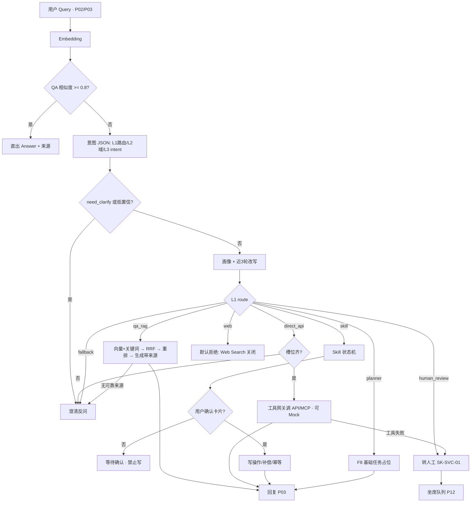
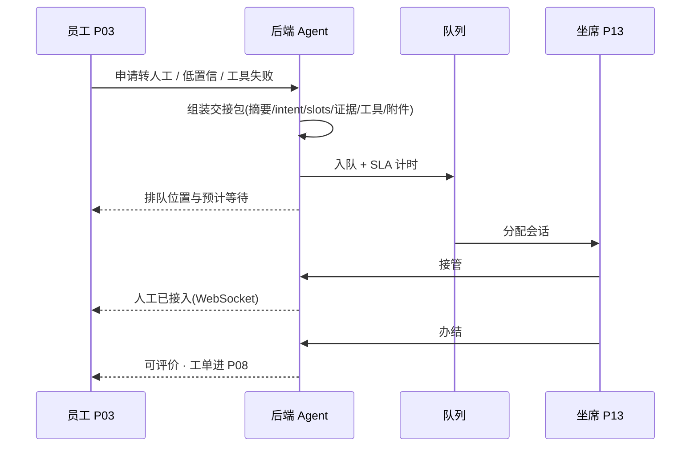

# PRD 定稿 — 太平洋金科·智能行政咨询助手

> 阶段 C | 定稿日期：2026-08-06  
> 依据：`.output/PRD-draft.md`（A1–A6 已确认）+ `.output/roadmap-draft.md` + B1/B2 原型（含 P02–P04 Agent 优先纠偏）  
> 配套：`roadmap-final.md` · `prototype-final.md` · `architecture-blueprint.md` · `ui-design-spec.md` · `test.pen`  
> 状态：**定稿，可进入开发（先前端后后端）**

---

## 1. 产品概述

### 1.1 一句话

面向约 **1,000** 内部账号的 Web 智能行政咨询助手：可信问答、实时可查、固定 Skills 可办、材料可预审、低置信转人工；运营可治理知识/意图/Skill/工具与 Bad Case，形成「问—查—办—审—服—运」闭环。

### 1.2 方案锚定

| 维度 | 锁定 |
|------|------|
| 能力框架 | 问 / 查 / 办 / 审 / 服 / 运 |
| 员工主交互 | **Agent 首页直问** + 对话三栏 + 确认卡片；全部服务为次要浏览入口 |
| 坐席交互 | 队列看板 + 三栏工作台 + 交接包 + AI 草稿 + 工单/专家抽屉 |
| 视觉 | Enterprise Light Ops Console（主色 `#1677FF`，底 `#F0F2F5`） |
| 前端 | Vue 3 + TypeScript + Pinia + Router（**不可替换**） |
| 后端 | Python 3.11+ / FastAPI / PyCore（**不可替换**） |
| 存储 | 目标 MySQL + Milvus；本地/演示可降级 SQLite + FAISS |
| 登录 | MVP 账号密码 + JWT；SSO → V1.1/V2 |
| 租户 | 单租户 |
| 渠道 | MVP 仅 Web；小程序/IM → V1.1/V2 |
| 外部检索 | Web Search **默认关闭** |

### 1.3 Mission / Persona

见 `.output/roadmap-final.md`。UI **三端壳** × **8 类角色权限点**（不拆 8 套首页）。

---

## 2. 主要功能与优先级

| ID | 主功能 | 优先级 | 做 | 不做 | 完成标准 |
|----|--------|--------|----|------|----------|
| F1 | 统一身份与权限 | MVP | 账号密码 JWT；8 角色；三端隔离；审计 | SSO；多租户 | 无权限不可达 |
| F2 | Agent 首页（员工默认） | MVP | 问候+大输入+建议问法；左会话/P0；待办摘要 | 管理者大屏 BI；KPI 卡片墙当主路径 | 默认可直问并跳转对话 |
| F3 | 智能咨询（问） | MVP | QA→意图→记忆改写→RAG+来源 | 无来源硬编；语音 | 可追源；低置信澄清/转人工 |
| F4 | 实时查询（查） | MVP | direct_api；可 Mock 标注 | 静态文档假装实时 | ≥2 条 P0 查询可验 |
| F5 | Skills 办理（办） | MVP | 13 Skills；P0 闭环；确认卡片 | Skill 缺失转 Planner 办事务 | P0 确认后任务可见 |
| F6 | 合规预审（审） | MVP | 规则预检、风险提示 | 代审批、自动付款 | 与 SK-FIN-01 打通 |
| F7 | 材料与 OCR | MVP | 上传、解析、校对、引用 | OCR 100% 承诺 | 状态可见可重试 |
| F8 | Planner / 内容产出（写） | MVP 精简 + V1.1 完整 | **MVP 精简**：文档改写、行政报告草稿、本人/权限范围内数据导出（见 §2.1）；任务可追踪 | 用 Planner 办报销/请假等事务型 Skill；完整 PPT 可视化编辑器；无权限批量拉他人敏感明细 | 三角色均可按权限矩阵发起；产出可下载/落任务 |
| F9 | 服务台（服） | MVP | 转人工、队列 SLA、交接、工单/专家、质检回访基础 | 外呼；智能排班 | 消息同步；超时高亮 |
| F10 | 运营治理（运） | MVP | 知识/意图/Skill/Prompt/工具/队列；Bad Case；看板；审计 | MVP 灰度/回滚流水线 | 发布生效、下线不可召回 |
| F11 | 知识生命周期 | MVP | 草稿→待审→发布→下线；有效期/权限标签 | 爬全网；知识图谱 | 仅有效已发布可检索 |
| F12 | 评测与验收口径 | MVP 展示 / V1.1 工业化 | 7 类 Bad Case；10 项指标；回归清单 | MVP 全自动 700 份次平台 | 坏例可闭环 |
| F13 | 多端入口 | MVP Web | Web 桌面优先、基础响应式 | MVP 小程序/原生 App | 三端主流程可验收 |

**P0 闭环：** 报销、请假、IT 报修、会议室、转人工。  
**冻结资产：** 13 Skills、36 工具契约（见 roadmap-final）；Intent 设计稿约 40 条**不冻结数量**，运行时仅认已发布。

### 2.1 内容产出能力矩阵（改写 / 报告 / 数据导出）

> 推演依据：行政咨询 Agent 的「写」应服务办事效率与服务台/运营闭环，而不是全员可拉全库敏感数据。  
> 演示账号映射：员工端=`employee`；坐席端=`agent`；运营端=`admin`（8 类角色用权限点区分，MVP 用三角色演示）。

#### 三类能力定义

| 能力 | 用户得到什么 | 典型输入 | 典型输出 |
|------|--------------|----------|----------|
| **文档改写** | 把草稿改成更规范的对内文书 | 原文 + 语气（正式/简洁） | 改写后正文（可复制/下载 `.md`） |
| **报告草稿** | 生成结构化行政/服务报告大纲与正文 | 主题 + 可选要点 | 报告 Markdown（可下载） |
| **数据导出** | 导出本人或权限范围内业务清单 | 数据类型 + 时间范围 | CSV / JSON（可下载） |

#### 谁可以有 / 谁不可以有（不是全都有）

| 角色（Persona） | 端壳 | 文档改写 | 报告草稿 | 数据导出 | 说明 |
|-----------------|------|----------|----------|----------|------|
| 普通员工 | 员工 | ✅ 本人文稿 | ✅ 个人办事小结类 | ✅ **仅本人**任务/工单/材料清单 | 不可导出他人或全司明细 |
| 审批人 | 员工 | ✅ 审批意见润色 | ✅ 个人待办处理小结 | ✅ 本人相关 + **待我审批**列表 | 不可导出全司报销明细 |
| 管理者 | 员工+洞察切片 | ✅ 管理通报润色 | ✅ **部门/授权范围**汇总报告 | ✅ **聚合指标**（人数、完成率等），默认不含他人原文全文 | 敏感字段脱敏；无跨部门越权 |
| 人工坐席 | 坐席 | ✅ 回复草稿 / 交接摘要改写 | ✅ 个案结案报告、班次小结 | ✅ **本人经办**工单与质检相关清单 | 不可导出全员 HR/薪资类数据 |
| 业务专家 | 坐席/运营 | ✅ 专业复核意见改写 | ✅ 领域风险说明报告 | ✅ 协同范围内个案 | 同坐席，偏领域文案 |
| 行政/HR/IT 业务运营 | 运营 | ✅ 制度解读稿润色 | ✅ 域内服务运营周报 | ✅ 域内服务/工单聚合导出 | 不可改系统审计原始日志权限模型 |
| AI/知识运营管理员 | 运营 | ✅ 知识草稿润色 | ✅ 知识质量 / Bad Case 报告 | ✅ 知识、意图、Bad Case、发布清单 | 内容治理向；非 bulk 员工隐私库 |
| 研发与技术运维 | 运营 | ⚠️ 仅运维说明类改写 | ✅ 容量/故障简报 | ✅ **审计日志、工具调用、系统指标** | **默认不开放**对业务公文大批量改写入口（避免越权代写） |

#### 全局禁止（任何角色）

- 用内容产出能力 **静默提交** 报销/请假/改薪等事务（仍走 Skill 确认闸）。  
- 导出或生成 **薪资、证件号、银行卡** 等明文。  
- 无来源硬编制度条款冒充已发布知识（报告中制度引用须可追源或标明「草稿待核对」）。  
- Web Search 默认关闭场景下，不把外网内容当正式制度写入报告。

#### MVP 落地范围（本轮开发目标）

1. **入口**：员工对话快捷指令 +「我的任务 / Planner」；坐席工作台侧「改写回复」；运营洞察侧「导出报告/清单」。  
2. **实现**：改写/报告走百炼（无 Key 则模板）；导出走服务端聚合 CSV。  
3. **权限**：按上表用 `employee` / `agent` / `admin` 做硬校验（管理者聚合、运维审计等能力在 `admin` 演示中部分合并）。  
4. **完整 PPT 幻灯片编辑器、跨文档合并** 仍归 **V1.1**；MVP 报告以 Markdown 大纲+正文代替 PPT 文件。

---

## 3. 页面清单与跳转（25 页 · 与原型一致）

### 3.1 页面表

| 编号 | 页面 | 端 | 主功能 | 备注 |
|------|------|----|--------|------|
| P01 | 登录 | 全员 | F1 | |
| P02 | Agent 首页 | 员工 | F2 | **员工默认**；直问主路径 |
| P03 | 智能对话 | 员工 | F3–F6、F8 | 三栏 + 确认卡片 |
| P04 | 全部服务 | 员工 | F5 | **次要浏览目录**（非第二首页） |
| P05 | 服务申请/确认 | 员工 | F5 | 与对话确认卡双入口 |
| P06 | 我的任务 | 员工 | F5/F8/F6 | 含历史 Tab；审批/Planner 筛选 |
| P07 | 任务详情 | 员工 | F5/F7 | |
| P08 | 我的工单 | 员工 | F9 | |
| P09 | 材料中心 | 员工 | F7 | |
| P10 | 消息中心 | 员工 | F2 | |
| P11 | 个人设置 | 员工 | F1 | |
| P12 | 队列看板 | 坐席 | F9 | 坐席默认；含图表 |
| P13 | 会话工作台 | 坐席 | F9/F3 | |
| P14 | 工单处理 | 坐席 | F9 | 专家协同为抽屉 |
| P15 | SLA 与班次 | 坐席 | F9/F12 | |
| P16 | 质检与回访 | 坐席 | F9/F12 | |
| P17 | 知识管理 | 运营 | F11/F10 | 运营默认 |
| P18 | 知识解析详情 | 运营 | F11/F7 | OCR/Chunk 校对 |
| P19 | 服务目录 | 运营 | F5/F10 | |
| P20 | 意图与 Prompt | 运营 | F3/F10 | 无灰度 |
| P21 | Skill 管理 | 运营 | F5/F10 | 13 Skills |
| P22 | 工具与模型 | 运营 | F4/F10 | 36 契约 + Mock |
| P23 | 队列与 SLA 配置 | 运营 | F9/F10 | |
| P24 | 运营洞察 | 运营 | F12 | Bad Case + 指标双 Tab |
| P25 | 权限与审计 | 运营 | F1 | 8 角色矩阵 |

### 3.2 跳转

```
P01 → P02（员工）/ P12（坐席）/ P17（运营）

员工: P02 → 发问→P03 | P0快捷→P03/P05 | 全部服务→P04 | P06|P08|P09|P10|P11
      P04 → P05 或回 P02（次要）
      P03 → P06|P08|P09（确认/转人工后）
      P06 → P07 → P09

坐席: P12 → P13 → P14；P12 → P15|P16
      P13 ↔ 员工会话（WebSocket）

运营: P17 → P18
      P19–P23 发布 → 影响 P02/P03/P04/P12
      P24（Bad Case | 指标）；P25 审计
```

**隔离：** 员工不可进坐席/运营；坐席不可进运营；菜单按 8 角色权限点显隐。

---

## 4. 核心流程图

### 4.1 智能回答主流程（含异常）



### 4.2 转人工时序（异常主路径）



### 4.3 知识发布


### 4.4 Skill 执行

预置状态机：**补槽 → 规则校验 → 确认卡片 → 调已登记工具 → 异常补偿**。  
禁止静默写操作；禁止事务 Skill 转交 Planner。

---

## 5. 组件交互说明

| 场景 | 影响模块 | 拟新增/关键模块 | 调用关系 |
|------|----------|----------------|----------|
| Agent 发问 | 前端 P02/P03；Chat API；Plugin 链 | `ChatService`、Intent/RAG/Tool/Skill Plugins | FE → REST → Service → Plugin → LLM/向量/工具 |
| 确认卡片 | P03/P05；Skill 状态机 | `ConfirmGate`（写前闸） | 仅确认后调用写工具 |
| 转人工 | P03/P08/P12/P13 | `HandoffService`、Queue、Ticket、WS | Bot → Queue → Agent WS 双向 |
| 知识发布 | P17/P18 | `KnowledgePipeline`、Indexer | 上传→OCR→Chunk→Embed→发布 |
| 运营配置 | P19–P23 | Catalog/Intent/Skill/Tool/SLA Config | 发布后运行时只读已发布配置 |
| Bad Case / 指标 | P24 | `EvalInsightService` | 标注改进闭环；看板读聚合 |
| 权限审计 | P25 | RBAC + AuditLog | 写操作落审计 |

---

## 6. 数据契约（已确认摘要）

| 域 | 要点 |
|----|------|
| 业务域 | 8：费用报销、差旅、HR、行政办公、IT、资产采购、服务台、开放式材料处理 |
| 平台域 | 知识制度治理、运营配置与评测 |
| 角色 | 8 类；UI 三端壳；审批人主战场在 P06/P07 |
| 画像 | 姓名/工号/部门/岗位/职级/地点/上级/偏好/高频意图；按 user_id 增量 |
| 对话 | QA 0.8；短窗 3 轮；意图置信 0.7；角色 user/assistant/system/agent |
| 路由 | qa_rag / direct_api / skill / planner / human_review / web / fallback |
| 知识 | 草稿→待审→已发布→已下线；仅有效已发布可检索 |
| 任务 | skill/planner/followup；写操作必须确认 |
| 工单 | 待接入→处理中→待补充→待专家→已解决→已关闭 |
| Bad Case | 7 类；待处理/已改进/已忽略 |
| 配置态 | 草稿/已发布/已下线（MVP **无灰度**） |

完整打勾记录见历史 `.output/PRD-draft.md` §5。

---

## 7. 关键业务规则

1. QA ≥ 阈值直出。  
2. 模糊只澄清，不调工具、不办结。  
3. 清晰意图经画像 + 短窗改写后再检索/调用。  
4. 高风险 / 低置信 / 工具失败 / 用户申请 → 转人工，交接含完整上下文。  
5. 知识与工具按业务域 + 角色权限过滤。  
6. 写操作必须用户确认（或审批节点）；禁止聊天静默提交。  
7. 外部 API 不可用 → Mock +「模拟数据」标识。  
8. Skill 不可用不得转交 Planner 办事务。  
9. 外部 Web Search 默认关闭。  
10. 单租户；关键写操作审计。  
11. 员工主路径为 Agent 直问；P04 仅浏览/筛选，不与 Agent 抢主入口。

---

## 8. 技术选型与风险

### 8.1 选型（已确定）

| 层 | 选型 |
|----|------|
| 前端 | Vue 3 + TypeScript + Pinia + Vue Router |
| 后端 | Python 3.11+ / FastAPI / PyCore |
| 业务库 | 目标 MySQL；本地可 SQLite（异步 SQLAlchemy） |
| 向量 | 目标 Milvus；本地可 FAISS |
| 实时 | WebSocket |
| 模型 | OpenAI 兼容路由（embedding/intent/rewrite/clarify/generate/rerank） |
| 文件 | 本地 uploads 或 NAS/对象存储适配层 |
| 缓存/队列 | V1 可简化；Redis/MQ 生产加固 → V1.1 |

**约束：** 使用 httpx/openai 时，初始化客户端须**清除环境代理相关配置**，不继承环境变量。

### 8.2 风险与缓解

| 风险 | 缓解 |
|------|------|
| 外部 API 不稳定 | 工具网关超时/重试/幂等 + Mock 开关 + UI「模拟数据」标识 |
| 幻觉与无来源回答 | 强制引用来源；无可靠来源则澄清或转人工 |
| 误执行写操作 | 确认卡片闸；高风险转人工；审计 |
| 金融泄密（外搜） | Web Search 默认关；运营白名单才开 |
| 向量/库环境差异 | 接口契约不变；本地 SQLite+FAISS 降级路径 |
| Intent/Prompt 误配 | 仅已发布生效；MVP 无灰度用发布/下线；Bad Case 闭环 |
| Planner 范围蔓延 | MVP 交付「改写/报告/权限内导出」精简版；**完整 PPT 编辑器 / 跨文档**仍明确 V1.1；事务流程禁止走 Planner |

---

## 9. 验收口径（MVP）

- P0 五闭环（报销、请假、IT 报修、会议室、转人工）员工端可走通。  
- 回答默认可追源（制度名/版本/生效日）。  
- 坐席可接管并见交接包；SLA 超时可辨。  
- 运营可发布知识/意图/Skill/工具；下线不可召回。  
- Bad Case 可登记与标记改进；核心指标可展示。  
- 权限隔离：三角色端互不可越权进入。

---

## 10. 阶段门禁

- [x] 与已确认原型（25 页 + Agent 优先）一致  
- [x] 无 TBD / 待定占位  
- [x] 功能均有 MVP / V1.1 / V2+ 优先级  
- [x] 主流程 + 转人工异常分支已覆盖  
- [x] 技术选型已锁定  

**下一步：** 开发模式 — 先前端（按定稿大改）→ 用户验收 → 再逐功能后端。进度维护于 `.output/plan.md`。
