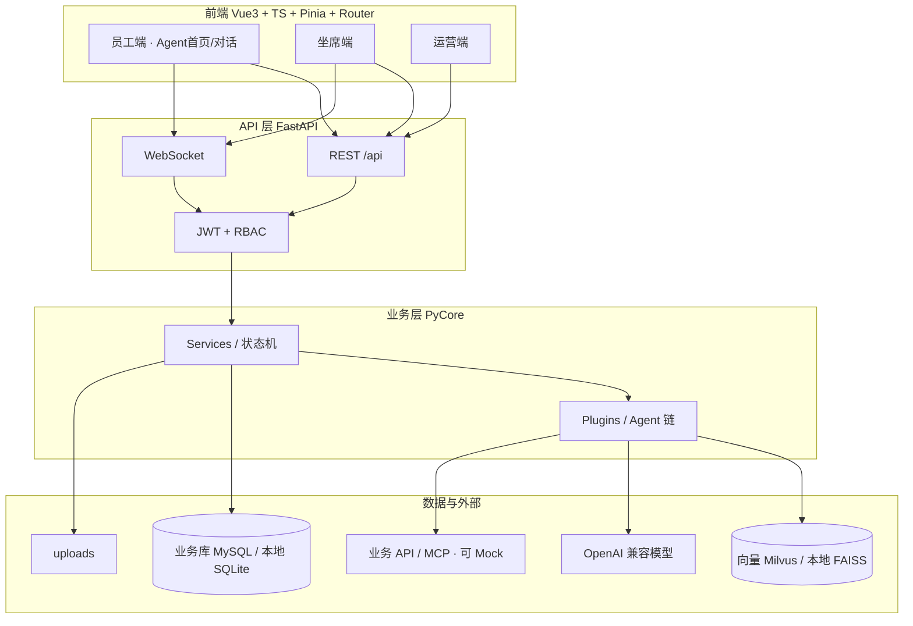
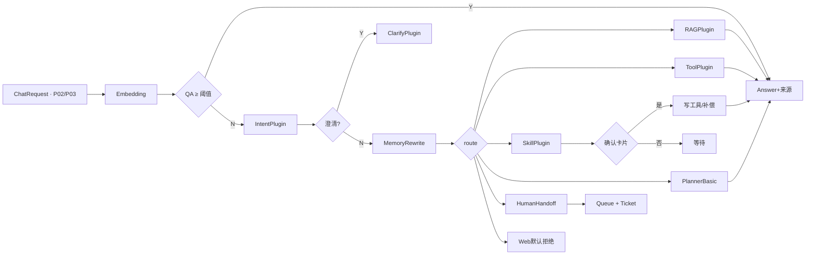

# 架构蓝图 — 太平洋金科·智能行政咨询助手

> 阶段 C | 定稿日期：2026-08-06  
> 对齐：`.output/PRD.md`、`.output/roadmap-final.md`、`.output/prototype-final.md`

---

## 1. 总体架构

---

## 2. 分层职责

| 层 | 目录约定（后端） | 职责 |
|----|------------------|------|
| API | `api/routes`、`deps` | 路由、鉴权、分页、统一响应 |
| Models | `src/models`、`db/models.py` | Pydantic 契约 vs ORM |
| Service | `services/` | 业务编排与状态机（BaseService） |
| Plugin | `plugins/` | Intent / RAG / Tool / Skill / Handoff / Planner |
| Repository | `db/`、`repositories/` | 异步会话与持久化 |
| Core | `core/`、`main` | ConfigManager、入口、配置 |

前端分包：`views/employee`（含 Agent 首页）、`views/agent`、`views/ops`；共享组件与 API client。

---

## 3. 核心运行时：对话 Plugin 链

**约束：**

- httpx / openai 初始化时**清除环境代理相关配置**，不继承环境变量。  
- 写操作必须经确认卡片或审批节点。  
- 工具：超时、重试、幂等、Mock 开关；仅已登记 36 契约。  
- 运行时仅加载**已发布** Intent / Prompt / Skill / 知识。

---

## 4. 关键模块与调用关系

| 模块 | 职责 | 被谁调用 | 调用谁 |
|------|------|----------|--------|
| Auth / RBAC | JWT、8 角色权限点 | 全部 API/WS | DB |
| ChatService | 会话消息、路由入口 | 员工/坐席 FE | Plugin 链 |
| ConfirmGate | 写前确认 | SkillService | ToolGateway |
| ToolGateway | http_api / mcp | Skill / direct_api | ExtAPI / Mock |
| KnowledgePipeline | 解析/Chunk/索引 | 运营 P17/P18 | Vec + DB + Files |
| HandoffService | 交接包、入队 | Chat / Skill 失败 | Queue / Ticket / WS |
| QueueSLA | 排队与 SLA | 坐席端 | DB |
| ConfigRegistry | 意图/Skill/工具/目录发布态 | 运营端 | DB（运行时只读已发布） |
| EvalInsight | Bad Case + 指标聚合 | P24 | DB |
| AuditLog | 关键写操作审计 | 各写路径 | DB |

---

## 5. 数据存储策略

| 用途 | 目标环境 | 本地/演示 |
|------|----------|-----------|
| 业务数据 | MySQL | SQLite |
| 向量检索 | Milvus | FAISS |
| 文件 | NAS/对象存储或本地盘 | `uploads/` |
| 会话实时 | WebSocket（可后接 Redis pub/sub） | 进程内 WS |

接口契约与领域模型不随存储实现变化。

---

## 6. 前端信息架构（与原型一致）

| 端 | 默认页 | 主路径 |
|----|--------|--------|
| 员工 | P02 Agent 首页 | 直问 → P03；P04 次要目录；任务/工单/材料 |
| 坐席 | P12 队列看板 | 会话工作台 / 工单抽屉 / SLA / 质检 |
| 运营 | P17 知识管理 | 配置发布链路 + 洞察 + 权限审计 |

可视化：P12 / P15 / P24 使用 ECharts（色板对齐设计变量）。

---

## 7. 安全基线

1. 三角色端路由守卫 + 权限点。  
2. 知识/工具按 domain + 权限标签过滤。  
3. 写操作确认 + 审计。  
4. Web Search 默认关闭。  
5. 高风险 / 低置信强制或建议转人工。  
6. 单租户；密钥与 `.env` 不入库。

---

## 8. 风险与缓解

| 风险 | 缓解 |
|------|------|
| 外部 API 抖动 | 网关超时/重试/幂等 + Mock |
| 模型幻觉 | 强制来源；无来源则澄清/转人工 |
| 误执行 | ConfirmGate；审计；高风险转人工 |
| 存储环境差异 | 仓储抽象；SQLite/FAISS 降级 |
| 配置误发布 | 仅已发布生效；Bad Case 闭环；V1.1 灰度 |

---

## 9. 开发顺序建议

1. **前端**：按 `prototype-final.md` 25 页 + Agent 优先大改，Mock 验收。  
2. **后端**：按 `.output/plan.md` 逐功能（建议 B0 环境 → 鉴权 → 对话链 → Skill/工具 → 坐席 → 运营）。  
3. 每功能用户测过再开下一项；禁止模型代跑安装与测试。

---

## 10. 门禁

- [x] 与 PRD / 路线图 / 原型定稿一致  
- [x] 技术栈无二选一待定  
- [x] 主链路与转人工异常已体现  
- [x] 可指导开发启动
